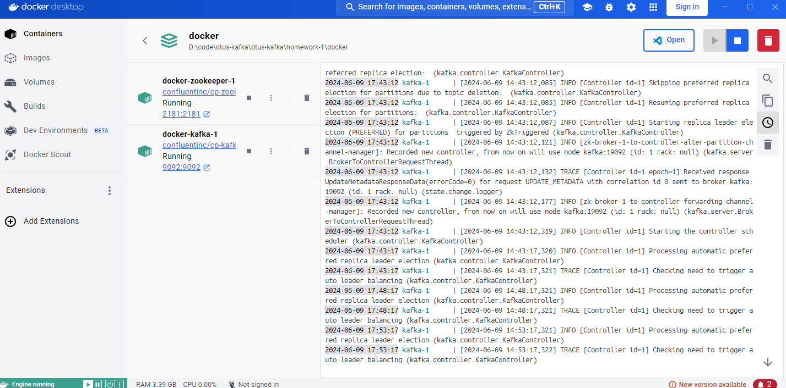
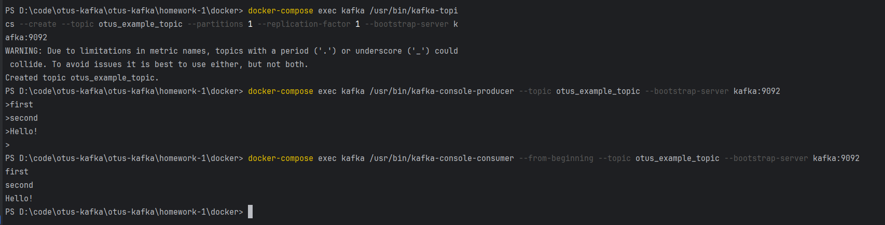

Запускаем сервисы с помощью контейнера docker
```shell
cd docker
docker-compose up -d   
```



Создать топик
```shell
docker-compose exec kafka /usr/bin/kafka-topics --create --topic otus_example_topic --partitions 1 --replication-factor 1 --bootstrap-server kafka:9092
```

Отправить сообщение
```shell
docker-compose exec kafka /usr/bin/kafka-console-producer --topic otus_example_topic --bootstrap-server kafka:9092
```

Получить сообщения
```shell
docker-compose exec kafka /usr/bin/kafka-console-consumer --from-beginning --topic otus_example_topic --bootstrap-server kafka:9092
```

