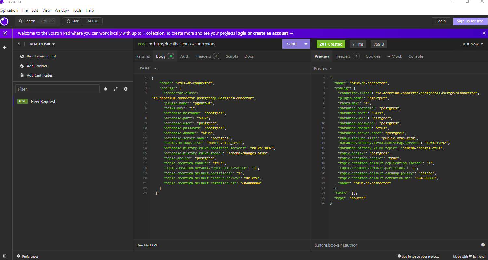
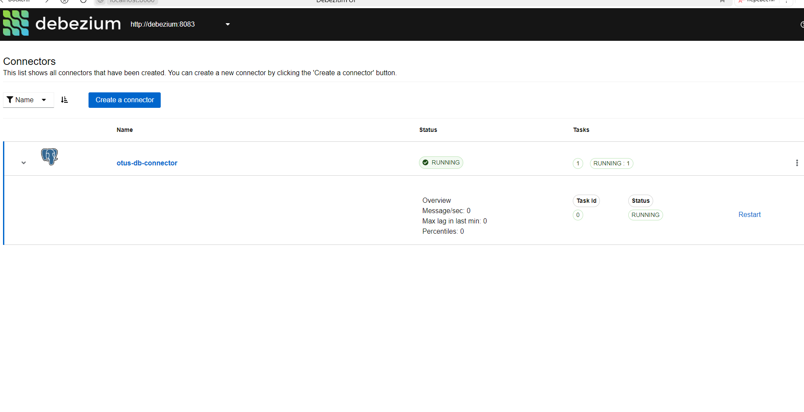
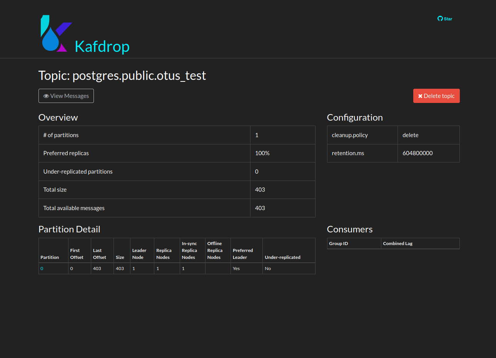

# Kafka Connect

## Научиться разворачивать Kafka Connect и настраивать интеграцию с postgresSQL

## Описание/Пошаговая инструкция выполнения домашнего задания:

Развернуть Kafka Connect, настроить интеграцию с postgreSQL используя Debezium PostgreSQL CDC Source Connector:

- Запустить Kafka
- Запустить PostgreSQL
- Создать в PostgreSQL тестовую таблицу
- Настроить Debezium PostgreSQL CDC Source Connector
- Запустить Kafka Connect
- Добаить записи в таблицу
- Проверить, что записи появились в Kafka

---

### Решение

1. Поднимаем docker

       docker-compose up -d

2. Загружаем [коннектор](./connector.json)

   

3. Debezium-ui:
   

4. Подключаемя и создаем записи в таблице otus_test

       delete  from otus_test
       with data as  (
       select generate_series(1 , 100) val)
       insert into   otus_test (id, homework, num)
       select  val , format('homework number %s' , val), val from data;

5. Проверем через kafdrop

